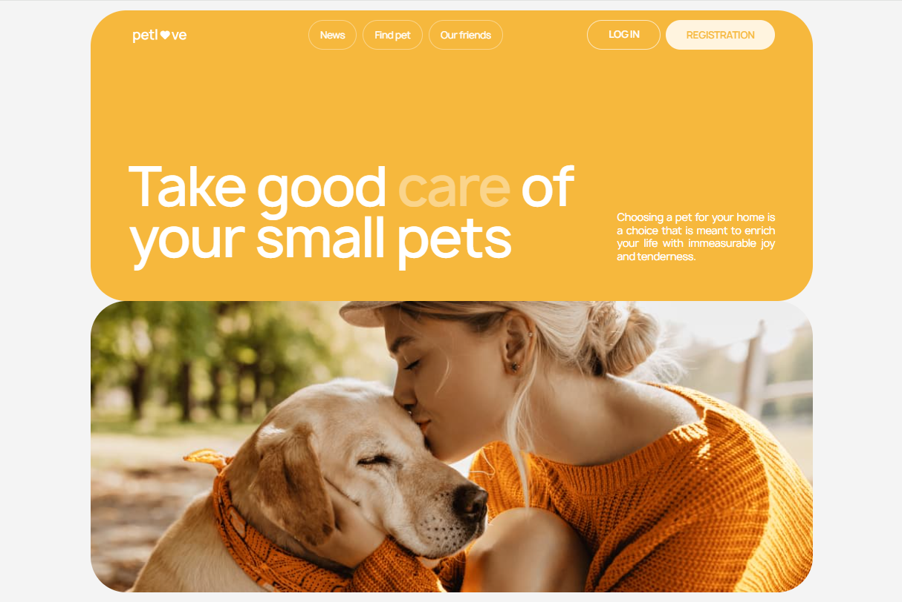
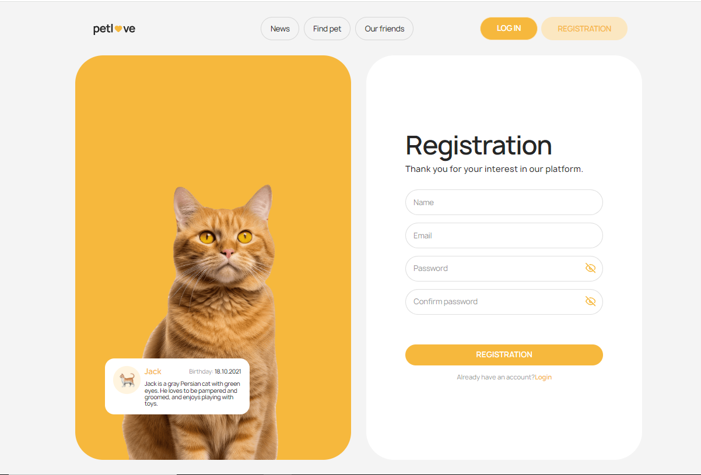

<h1 align="center">
   
  
   
Pet love
   
</h1>

Find your love pet with our service. Easy filtering, ability to add to favorites
and quickly contact with owner.

## Technology:

- TypeScript
- React
- React-dom
- React-responsive
- React-select
- Redux Toolkit
- Redux Persist
- Formik + Yup
- react-hot-toast
- Tailwind-css
- Material-ui (pagination)
- Vite

## Scripts:

| LEFT          | RIGHT                   |
| ------------- | ----------------------- |
| npm i         | dependency installation |
| npm run dev   | start local server      |
| npm run build | production build        |

[Link to site](https://pet-love-project.vercel.app/ "Pet love")
[Link to Figma layout](https://www.figma.com/file/puMNfZVg4YI8UZoJ1QiLLi/Petl%F0%9F%92%9Bve?type=design&node-id=55838-750&mode=design&t=Xg1IwIcKebTl5xGs-0 "Figma Pet love")

